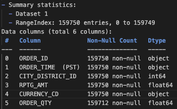
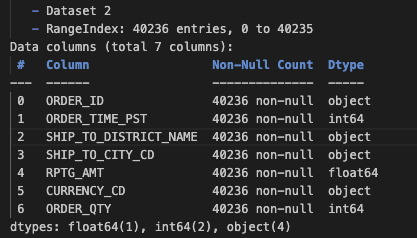
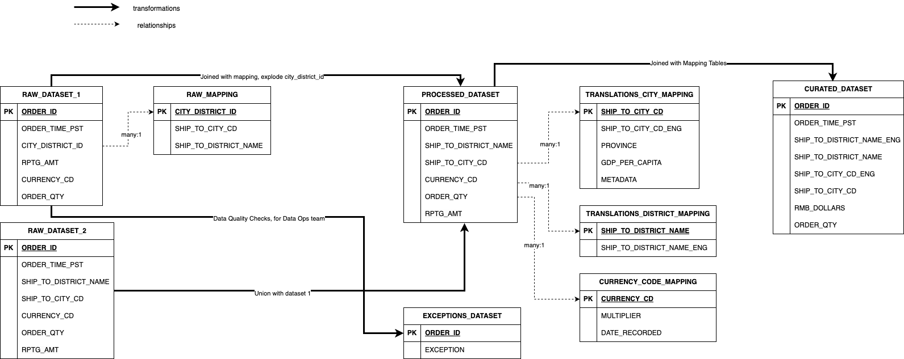
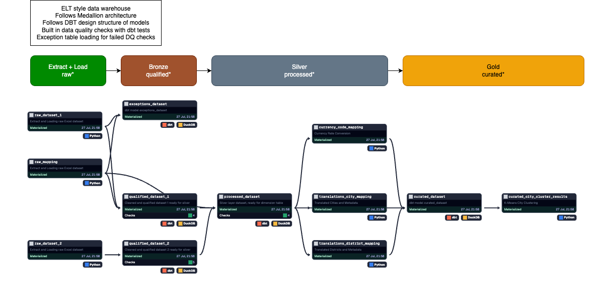
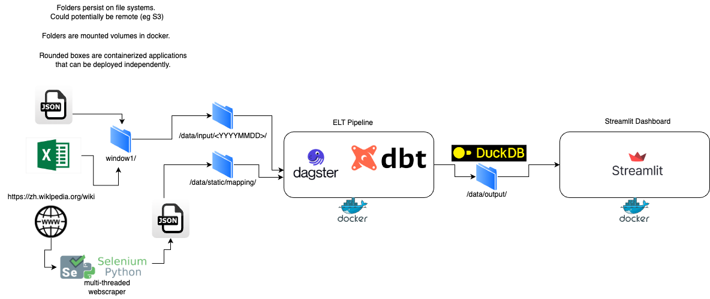
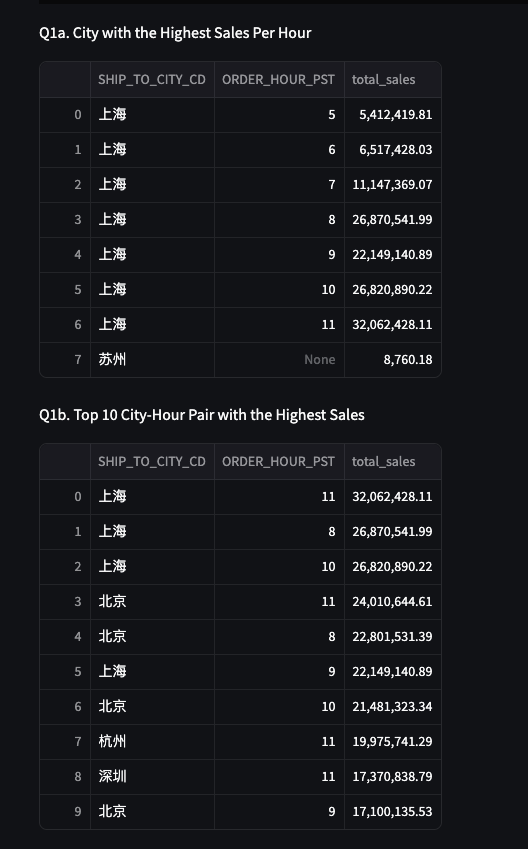

## Scenario :
The Sales team would like to analyse on store sales performance across different locations, and obtain actionable insights for driving strategic marketing initiatives.

For example, ability to
- identify which cities are performing better, and any correlation to location or timing?
- plan on areas of investment (marketing campaigns, opening of stores etc)

You are provided a sample data set of orders for a single day between 5am and 12pm. The order timestamp is in format HHMMSS.

## Requirements
Perform the following data engineering tasks (Python, Scala, Java etc.)
- Setup a database locally. For example, you can use mysql or sqlite3.
- Process and load the data from both “dataset1.xlsx” and “dataset2.json”, performing  any data cleansing and mapping as required
- Additional bonus - perform translation of districts and cities to English
- Create the necessary tables to answer the questions below

Build a simple web app (Flask, Django, NodeJS etc.) which provides actionable insights to sales analysts on sales performance across different locations.
Plot some charts to allow users to answer the following questions :
- Find the city with the highest per-hour sales
- Find the city with the highest average sales by district
- Discuss and show how to cluster cities into n-number of tiers based on sales (e.g. lowest spending to highest spending).
- Discuss (and if possible, show) what other types of metadata we can include to get deeper insights and analysis.
- Analyse the dataset yourself and share/showcase any interesting insights you find

In the presentation interview session : 
Do an intro & presentation on this project (includes demo of the app). Highlight any issues found in the data, or challenges with the process. (1 hour)
Q&A and code review of data preparation and the app (30 mins) 

## Prerequisites
- Docker (Must have) 
- Python 3.12.4 (In case you are not running Docker and need to build from source)
- 3Ds stack (Dagster, dbt, Duckdb) - These are all managed by docker. 

## How to use
- From the root of this directory,
- `make build` to use docker compose to build both dagster + dbt container and streamlit container 
- if not using make commands, run `docker-compose up --build` to get the same result. 
- Dagster will be listening on localhost 3000 and streamlit will be listening on port 8501. 
- Highly recommended to build using the above two methods, otherwise if building by source, install python 3.12.4, and then create a `venv` using the provided make commands and install `requirements.txt`. After pip install, cd to `orchestrator` and run `dagster dev`. Or you can run `dbt build` in the root folder. 

## Folder Structure 
- `assets/`: Contains project documentation files like screenshots, images,  ERDs, architecture diagrams 
- `data/`: Contains input data(partioned by date and window), output data, static mapping/cluster/geojson files and backups all of the above. 
- `eda/`: Contains Jupyter notebook used for initial Exploratory Data Analysis
- `macros/`: Macros used in dbt. 
- `models/`: dbt Models. Split further into qualified, processed and curated. 
- `orchestrator/`: Contains all python and config files needed to run dagster. Also defines sources for dbt. 
- `scripts/`: Initial version of the project where ELT logic was housed in pure python scripts. Contains scripts for webscraper and k-means clustering. 
- `visualization`: Contains all python and config files needed to run streamlist dashboard. 

## Section 1 - Exploratory Data Analysis 
**Initial Thoughts and Questions**
- My goal here was to do a deep dive into the source datasets to make heads or tails of what i was looking at. 
- Looking at the Excel data, it was clear that the two sheets were related by CITY_DISTRICT_ID, an identifier for each unique city-district pairing. 
- Looking at the JSON data, it looked like the schema between the two could be unified. 

**EDA**
- Tried joining the two datasets based on ORDER_ID, returned an empty set. This means that there are no overlapping ORDER_ID. Each is unique across both datasets. 
- This was the confirmation i needed to prove both datasets could be part of one whole. 
- Confirmed this dataset represents transactions of goods/services with China. -> Thanks to ORDER_QTY and RPTG_AMT
- Lack of SKU or any product key means each order_id is a rolled up aggregate or they represent the same goods and services, most likely the former. 
- Had to confirm the names of these chinese cities were real -> Google, Wikipedia, ChatGPT confirmed it.
- Current hypothesis: Perhaps each dataset could logically represent a type of store (physical,online) or are grouped by geographical locations?
- Contain same schema just that one is denormalized and the other is normalized
- Used pandas to profile the data and generate descriptive statistics. 
- 
- 
- Clearly based on the above, we have some data quality issues!

## Section 1.5 - Data Quality Checks
- ORDER_QTY: 
  - dataset 1: 38 rows failed
  - dataset 2: 0 rows failed
  - checks applied: valid integer, greater than 0 
- CURRENCY_CD
  - dataset 1: 37 rows where currency is USD
  - dataset 2: all rows are RMB, none are USD
  - checks applied: scan for unique values across both datasets, row distribution and skew
- RPTG_AMT
  - dataset 1: no issues found 
  - dataset 2: no issues found 
  - checks applied: greater than 0, float type with 2 dp, no significant outliers
- CITY_DISTRICT_ID
  - dataset 1: 37 rows where CITY_DISTRICT_ID = 999999
  - checks applied: join city_district_id with mapping table 
- SHIP_TO_DISTRICT_NAME and SHIP_TO_CITY_CD:
  - dataset 2: no issues found
  - i note that some cities and districts cannot be found in excel mapping table -> dimension table is out of date
  - checks applied: non-null and valid strings 
- ORDER_TIME_PST
  - dataset 1: 4 rows where time is "time"
  - dataset 2: no issues found
  - checks applied: valid integer, greater than 0

**Data remediation:**  
  - Catch all of the above errors, replace invalid values with NULL or NaN
  - For each error, grab their ORDER_ID key, and load them into EXCEPTIONS table with descriptive error msg of data quality failure. 
  - Reasoning: For most analytical OLAP warehouses, data just needs to only be eventually consistent, i thought it is better to have partially incorrect data than to have them completely excluded. Plus, with the EXCEPTIONS table, turn around time to resolve DQ issues can be shortened. 

## Section 2 - Data Engineering

**Entity Relations Diagram** 

- Modelled relations with fact table (dataset) 
- Star schema (fact table joined with dimension tables (mappings)) 
- CURRENCY_CODE_MAPPING should be modelled as Slowly Changing Dimension type 2 as the exchange rate fluctuates. 
- Propose to use an averaged currency conversion rate to reduce shocks from forex market
- Decoupled city and district mappings into two separate mapping tables -> Alternatively can consider modelling a province, city, district mapping in one table with an assigned ID. 

**Data Flow** 

- Following medallion architecture setup (Bronze, Silver, Gold) as popularized by databricks. 
- dbt also advocates for a similar staging and mart distinction 
- dbt also has some level of built in data testing. Refer to schemas.yml for tested fields. 
- Building idempotent pipelines: Philosophy of pipelines should be to upsert where possible, update if data exists, insert if do not, otherwise each rerun will have multiple duplicate data rows. 
- Why are idempotent pipelines important? I realized a mistake in bronze layer that the columns CITY and DISTRICT in dataset 2 were swapped, with idempotent pipeline, i just had to change the position of columns in my DDL script, and run everything from the top to get back to a correct state.

**Architecture Diagram:**

- Key technology stack:
  - Dagster (Orchestrator and Executor for jobs) - Docker managed
  - Dbt (SQL Templating engine) - Docker managed
  - Duckdb (OLAP datawarehouse) 
  - Python and Selenium for webscraping 
  - Python and Sci-kit learn for k-means clustering.
  - Python and Streamlit for dashboard viz - Docker managed  

**Challenges Faced** 
- Initially, i was running an Airflow <-> Postgres setup on two docker containers 
- Unexpectedly, standing up a docker container for postgres and using pandas + sqlalchemy + psycopg2 as ORM and db driver were harder than expected with non-ideal performance. 
- In the interest of time, i havent deep dived into why performance was so slow, was taking ~8 mins to bulk load 150k rows into postgres. 
- Not to mention, there was way too many dependencies even within docker containers to manage
- Cause of that, i switched to duckdb with much better performance and minimal bloat, it has no other dependencies and can standalone, and plays nice with excel,json and pandas. Any smaller and it would be a binary! 
- As a result, duckdb is heavily reliant on SQL and less on ORM, hence the project became an SQL heavy workflow, which made sense to bring in dbt at that point. 
- By the way, it is my first time using Dagster, duckdb and dbt! Glad to try out new technologies for this project. 
  
## Section 2.5 Translation feature
- Method 1: Reading from Wikipedia
  - Pros and cons: pros, relatively static, reliable, although quite a few misses, but could work in a pinch
  - By looping through each city and district and appending it to the end of the url, i could see if wikipedia had an entry on that city/district.
  - At first, i was scraping the english wikipedia at https://en.wikipedia.org/wiki/, unsurprisingly this got quite alot of misses that didnt work quite as well.  
  - Then, after playing around with google, i realized there is a separate wikipedia domain at https://zh.wikipedia.org/wiki/ for mainly the chinese market! No surprises that this one fared much better. 
  - There was a small problem where the http response object was still in chinese, and i still had the translation issue. 
  - Enter Selenium: By making use of the translate function in wikipedia itself, i could hit the endpoint, translate it to english, and then scrape it using beautiful soup 4. 
  - Now this solution is full fledged, not only could i find the english name, i could also pull in additional metadata that is needed downstream all in JSON format. Two birds with one stone. 
  - Achieved 95% valid translations for cities
  - Achieved 98% valid translatiosn for districts

- Method 2: Using Translate API
  - For some reason, all API clients using google or even bing seem to time out and is not very reliable. 
  - Tried some opensource solutions that didnt require an API key, most of the responses were laughable with very few hits

- Method 3: LLM translation (locally hosted and api)
  - Open source LLM models on hugging face like the Helsinki-NLP/opus-mt-en-fr were also laughable in some of the translations with quite small rate limiting 
  - Same issue as above, timed out after a few requests 
  - Locally hosted models could work but were too expensive and resource intensive to host, not to mention time consuming to wrangle with for deployment 

- Method 4: Manual Translation by copying into ChatGPT:
  - Once off manual effort to generate key value pairs
  - This worked second best. If wikipedia scraping could not cut it, this was my best alternative. 
 
**Scalability:**
  - Dockerized applications have ability to scale to cloud service providers which can provision serverless container runners (AWS ECS)
  - Currently Duckdb runs on a single node while the persistent file is stored in file storage. The duckdb file could be hosted in an s3 bucket for multiple concurrent reads, however it is not designed for multiple concurrent writes. Which would be suitable for an ELT pipeline as there is only one pipeline writing to the datawarehouse.  
  - Alternatively, proposal to onboard to enterprise datawarehouse platform (Snowflake, dbt cloud, Redshift) or enterprise data platform (Databricks). Can also build on cloud native solutions (Kubernetes deployments) 
  - Python and Selenium module have been optimized for concurrency by using a thread-safe multithreading approach to scrape wikipedia. 
  - Can consider enterprise BI tools (Tableau/Quicksight/Metabase) for visualization

## Section 3 - Analysis and Findings
**Q1.Find the city with the highest per-hour sales**

Analysis: This question looks like it can be interpreted in 2 ways. 

Either 1) For each hour, find the city with the highest spending or 2) Find the city-hour pair with the highest spending. Why not both? 

The interesting analysis is that while Shanghai tops the charts in sales across all times of day, at certain peak periods, other cities can do better in sales than Shanghai at off-peak periods. Refer to the next two figures.

~~~~~~~~~~~sql
WITH HourlySales AS (
    SELECT
        SHIP_TO_CITY_CD,
        ROUND(CAST(ORDER_TIME_PST AS BIGINT) / 10000) AS ORDER_HOUR_PST,
        SUM(RMB_DOLLARS) AS total_sales,
        ROW_NUMBER() OVER (PARTITION BY ROUND(CAST(ORDER_TIME_PST AS BIGINT) / 10000) ORDER BY SUM(RMB_DOLLARS) DESC) AS rank
    FROM
        CURATED_DATASET
    GROUP BY
        SHIP_TO_CITY_CD,
        ROUND(CAST(ORDER_TIME_PST AS BIGINT) / 10000)
)
SELECT
    SHIP_TO_CITY_CD,
    ORDER_HOUR_PST,
    total_sales
FROM
    HourlySales
WHERE
    rank = 1
ORDER BY
    ORDER_HOUR_PST;
~~~~~~~~~~~~~~~~~~~~~~~

**Q2.Find the city with the highest average sales by district**

**Q3.Discuss and show how to cluster cities into n-number of tiers based on sales (e.g. lowest spending to highest spending).**

## About Me
Hi there! Thanks for reviewing my takehome assessment!

My name is Yao Kuan and im currently a Data Engineer in the DE team within the Government of Singapore Technology Agency. We work mainly on Whole-of-Government data platforms for internal users of all walks of life.

In my day to day, i usually work on not just building data pipelines, but on building data platforms, which of course covers different domains from Security, Networking, DevOps, AI/ML and a little bit of Frontend engineering with a dominant Backend and Data engineering focus.

For us, the name of the game is to move as much overhead as we can over to our cloud service provider, happy to chat more about how we achieved this!

Last but not least, recently i have been contributing to an open source python SDK known as python-telegram-bot. Find my contribution here: https://github.com/thatguylah/python-telegram-bot

Enough about me though, lets get started!